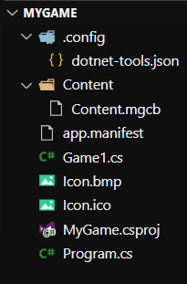
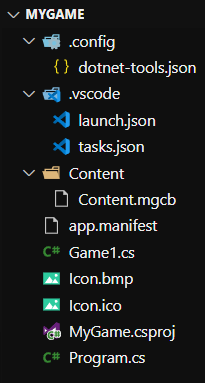

# Developing with Visual Studio Code

Visual Studio Code is a text editor. You can use it on many platforms. With the right setup you can have a good debugging environment for coding your MonoGame projects.

## Setup

Before you start, make sure to [download vscode](https://code.visualstudio.com/download) and install it. Follow [Get started](../get-started.md) to get a basic project going.

Open the game's directory in vscode. You can do that by dragging the directory directly over vscode. You should see something like this in the Explorer (Ctrl + Shift + E):



```
Content/
   Content.mgcb
app.manifest
Game1.cs
Icon.bmp
Icon.ico
MyGame.csproj
Program.cs
```

## Extensions

You will need the following extension:

* [C#](https://marketplace.visualstudio.com/items?itemName=ms-dotnettools.csharp)

## Launch / Task

vscode's configuration is done using json files. Create a new folder called `.vscode`. Inside it, create two files called `tasks.json` and `launch.json`.

Inside `tasks.json` add the following content. Edit the csproj's name if yours is different:

```json
{
    "version": "2.0.0",
    "tasks": [
        {
            "label": "buildDesktopGL",
            "command": "dotnet",
            "type": "process",
            "args": [
                "build",
                "${workspaceFolder}/MyGame.csproj"
            ],
            "problemMatcher": "$tsc"
        }
    ]
}
```

Inside `launch.json` add the following content. Edit the DLL name if your game has a different name:

```json
{
   // Use IntelliSense to find out which attributes exist for C# debugging
   // Use hover for the description of the existing attributes
   // For further information visit https://github.com/OmniSharp/omnisharp-vscode/blob/master/debugger-launchjson.md
   "version": "0.2.0",
   "configurations": [
        {
            "name": "Run DesktopGL platform",
            "type": "coreclr",
            "request": "launch",
            "preLaunchTask": "buildDesktopGL",
            // If you have changed target frameworks, make sure to update the program path.
            "program": "${workspaceFolder}/bin/Debug/netcoreapp3.1/MyGame.dll",
            "args": [],
            "cwd": "${workspaceFolder}",
            // For more information about the 'console' field, see https://github.com/OmniSharp/omnisharp-vscode/blob/master/debugger-launchjson.md#console-terminal-window
            "console": "internalConsole",
            "stopAtEntry": false
        }
    ]
}
```

This configuration will allow you to debug your game by pressing F5. You will also be able to set some breakpoints when debugging.

You should now see:



```
.vscode/
   launch.json
   tasks.json
Content/
   Content.mgcb
app.manifest
Game1.cs
Icon.bmp
Icon.ico
MyGame.csproj
Program.cs
```

# Read more

* [Tasks in Visual Studio Code.](https://code.visualstudio.com/docs/editor/tasks)
* [Debugging in Visual Studio Code.](https://code.visualstudio.com/docs/editor/debugging)
