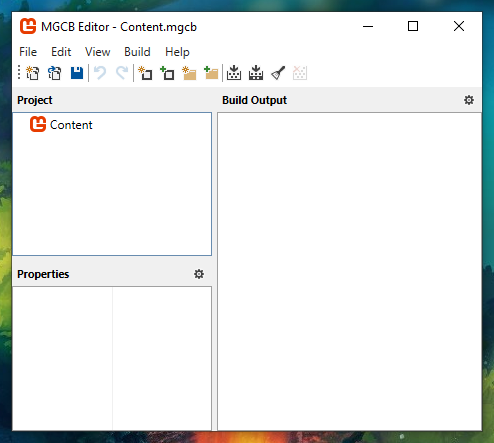

# Get started

This guide will give you the steps to install MonoGame, get a basic project setup, and build an output that you can publish.

## Install

1. Get the [.NET 8.0 SDK](https://dotnet.microsoft.com/download).
   * Test that dotnet is installed correctly:
    ```
    dotnet --version
    ```
2. Get the MonoGame templates:
    ```
    dotnet new install MonoGame.Templates.CSharp
    ```
    You can ignore this error:
    > Error: Failed to load template from ...
    > Details: 'identity' is missing or is an empty string.

## Create a new game

Replace `MyGame` with your game's name in the following two command:

```
dotnet new mgdesktopgl -o MyGame
cd MyGame
```

## Run

```
dotnet run
```

## Publish

You can publish on Windows, Mac, and Linux using:

```
dotnet publish -c Release -r win-x64 -o artifacts/windows --self-contained
dotnet publish -c Release -r osx-x64 -o artifacts/osx --self-contained
dotnet publish -c Release -r linux-x64 -o artifacts/linux --self-contained
```

You'll find the output in:

```
artifacts/windows
artifacts/osx
artifacts/linux
```

You can zip those folders to share your game.

## MonoGame Content Builder Editor

To launch the MonoGame Content Builder Editor, you can call the following command from the root folder of your project:

```
dotnet mgcb-editor Content/Content.mgcb
```

You should see this window appear:



## Notes

To build shaders, make sure you have the [Visual Studio 2013 redistributable](https://aka.ms/highdpimfc2013x64enu) installed. Otherwise you might see an error about the builder being unable to load libmojoshader_64.dll.

## Read more

You can read more getting started info from the official [MonoGame docs](https://docs.monogame.net/articles/getting_started/0_getting_started.html).

---

Now that you have a project, the next step is to setup a development environment. [Developing with Visual Studio Code](./develop-vscode/README.md).
