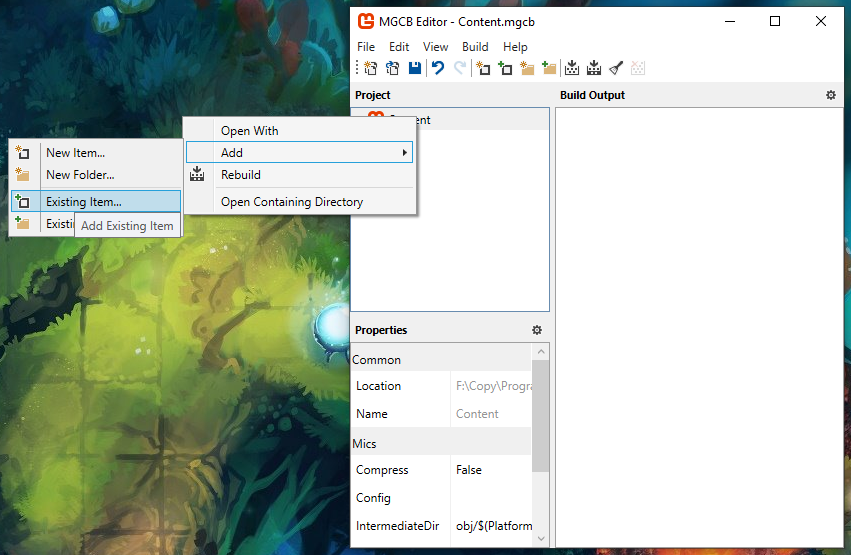
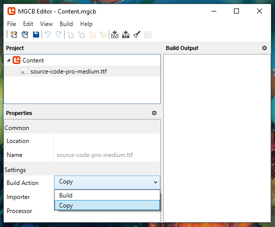

# Persistent game settings
Preserve and load data between game runs in a json file.

This tutorial builds on top of [Fullscreen](../../how-to/fullscreen.md).

You will learn how to load and save game settings. You will also learn how to draw text with [FontStashSharp](https://github.com/rds1983/FontStashSharp).

## Project setup

The completed project can be found [here](https://github.com/learn-monogame/persistent-game-settings).

### Libraries

This tutorial relies on two libraries: [Apos.Input](https://github.com/Apostolique/Apos.Input) and [FontStashSharp](https://github.com/rds1983/FontStashSharp).

You can install them with the following two commands:

```
dotnet add package Apos.Input
dotnet add package FontStashSharp
```

Apos.Input provides a simplified API over the MonoGame mouse and keyboard API.

FontStashSharp is a runtime text rendering library. It manages a texture behind the scene to render glyphs on demand.

### Assets

Add the following font to the `Content` folder and call it `source-code-pro-medium.ttf`. [Download source-code-pro-medium.ttf](https://github.com/learn-monogame/persistent-game-settings/blob/main/Content/source-code-pro-medium.ttf)

### Content pipeline

Open `Content.mgcb` using the MonoGame Content Builder Editor interface. (Read [Get started](../../how-to/get-started.md) to learn how to get it.) Add the font to the content pipeline editor as an existing item:



Change the build action to copy.



If you open `Content.mgcb` as a text file, this is the content you will see:

```
#----------------------------- Global Properties ----------------------------#

/outputDir:bin/$(Platform)
/intermediateDir:obj/$(Platform)
/platform:DesktopGL
/config:
/profile:HiDef
/compress:True

#-------------------------------- References --------------------------------#


#---------------------------------- Content ---------------------------------#

#begin source-code-pro-medium.ttf
/copy:source-code-pro-medium.ttf
```

### Source code

#### Settings.cs

Create a `Settings.cs` file. Paste this content in:

```csharp
namespace GameProject {
    public class Settings {
        public int X { get; set; } = 320;
        public int Y { get; set; } = 180;
        public int Width { get; set; } = 1280;
        public int Height { get; set; } = 720;
        public bool IsFixedTimeStep { get; set; } = true;
        public bool IsVSync { get; set; } = false;
        public bool IsFullscreen { get; set; } = false;
        public bool IsBorderless { get; set; } = false;
    }
}
```

#### Game1.cs

```csharp
using System;
using System.IO;
using System.Text.Json;
using Microsoft.Xna.Framework;
using Microsoft.Xna.Framework.Graphics;
using Microsoft.Xna.Framework.Input;
using Apos.Input;
using FontStashSharp;

namespace GameProject {
    public class Game1 : Game {
        public Game1() {
            _graphics = new GraphicsDeviceManager(this);
            IsMouseVisible = true;
            Content.RootDirectory = "Content";

            _settings = EnsureJson<Settings>("Settings.json");
        }

        protected override void Initialize() {
            Window.AllowUserResizing = true;

            IsFixedTimeStep = _settings.IsFixedTimeStep;
            _graphics.SynchronizeWithVerticalRetrace = _settings.IsVSync;

            _settings.IsFullscreen = _settings.IsFullscreen || _settings.IsBorderless;

            RestoreWindow();
            if (_settings.IsFullscreen) {
                ApplyFullscreenChange(false);
            }

            base.Initialize();
        }

        protected override void LoadContent() {
            _s = new SpriteBatch(GraphicsDevice);

            InputHelper.Setup(this);

            _fontSystem = new FontSystem();
            _fontSystem.AddFont(TitleContainer.OpenStream($"{Content.RootDirectory}/source-code-pro-medium.ttf"));
        }

        protected override void UnloadContent() {
            if (!_settings.IsFullscreen) {
                SaveWindow();
            }

            SaveJson<Settings>("Settings.json", _settings);

            base.UnloadContent();
        }

        protected override void Update(GameTime gameTime) {
            InputHelper.UpdateSetup();

            if (_quit.Pressed())
                Exit();

            if (_toggleFullscreen.Pressed()) {
                ToggleFullscreen();
            }
            if (_toggleBorderless.Pressed()) {
                ToggleBorderless();
            }
            if (_resetSettings.Pressed()) {
                bool oldIsFullscreen = _settings.IsFullscreen;
                _settings = new Settings();
                SaveJson("Settings.json", _settings);

                ApplyFullscreenChange(oldIsFullscreen);
            }

            InputHelper.UpdateCleanup();
            base.Update(gameTime);
        }

        protected override void Draw(GameTime gameTime) {
            GraphicsDevice.Clear(Color.Black);

            var font = _fontSystem.GetFont(24);
            string mode = _settings.IsBorderless ? "Borderless" : _settings.IsFullscreen ? "Fullscreen" : "Window";
            Vector2 modeCenter = font.MeasureString(mode) / 2f;
            Vector2 windowCenter = new Vector2(GraphicsDevice.Viewport.Width, GraphicsDevice.Viewport.Height) / 2f;

            _s.Begin();
            _s.DrawString(font, mode, windowCenter - modeCenter, Color.White);
            _s.End();

            base.Draw(gameTime);
        }

        public void ToggleFullscreen() {
            bool oldIsFullscreen = _settings.IsFullscreen;

            if (_settings.IsBorderless) {
                _settings.IsBorderless = false;
            } else {
                _settings.IsFullscreen = !_settings.IsFullscreen;
            }

            ApplyFullscreenChange(oldIsFullscreen);
        }
        public void ToggleBorderless() {
            bool oldIsFullscreen = _settings.IsFullscreen;

            _settings.IsBorderless = !_settings.IsBorderless;
            _settings.IsFullscreen = _settings.IsBorderless;

            ApplyFullscreenChange(oldIsFullscreen);
        }

        public static string GetPath(string name) => Path.Combine(AppDomain.CurrentDomain.BaseDirectory, name);
        public static T LoadJson<T>(string name) where T : new() {
            T json;
            string jsonPath = GetPath(name);

            if (File.Exists(jsonPath)) {
                json = JsonSerializer.Deserialize<T>(File.ReadAllText(jsonPath), _options);
            } else {
                json = new T();
            }

            return json;
        }
        public static void SaveJson<T>(string name, T json) {
            string jsonPath = GetPath(name);
            string jsonString = JsonSerializer.Serialize(json, _options);
            File.WriteAllText(jsonPath, jsonString);
        }
        public static T EnsureJson<T>(string name) where T : new() {
            T json;
            string jsonPath = GetPath(name);

            if (File.Exists(jsonPath)) {
                json = JsonSerializer.Deserialize<T>(File.ReadAllText(jsonPath), _options);
            } else {
                json = new T();
                string jsonString = JsonSerializer.Serialize(json, _options);
                File.WriteAllText(jsonPath, jsonString);
            }

            return json;
        }

        private void ApplyFullscreenChange(bool oldIsFullscreen) {
            if (_settings.IsFullscreen) {
                if (oldIsFullscreen) {
                    ApplyHardwareMode();
                } else {
                    SetFullscreen();
                }
            } else {
                UnsetFullscreen();
            }
        }
        private void ApplyHardwareMode() {
            _graphics.HardwareModeSwitch = !_settings.IsBorderless;
            _graphics.ApplyChanges();
        }
        private void SetFullscreen() {
            SaveWindow();

            _graphics.PreferredBackBufferWidth = GraphicsAdapter.DefaultAdapter.CurrentDisplayMode.Width;
            _graphics.PreferredBackBufferHeight = GraphicsAdapter.DefaultAdapter.CurrentDisplayMode.Height;
            _graphics.HardwareModeSwitch = !_settings.IsBorderless;

            _graphics.IsFullScreen = true;
            _graphics.ApplyChanges();
        }
        private void UnsetFullscreen() {
            _graphics.IsFullScreen = false;
            RestoreWindow();
        }
        private void SaveWindow() {
            _settings.X = Window.ClientBounds.X;
            _settings.Y = Window.ClientBounds.Y;
            _settings.Width = Window.ClientBounds.Width;
            _settings.Height = Window.ClientBounds.Height;
        }
        private void RestoreWindow() {
            Window.Position = new Point(_settings.X, _settings.Y);
            _graphics.PreferredBackBufferWidth = _settings.Width;
            _graphics.PreferredBackBufferHeight = _settings.Height;
            _graphics.ApplyChanges();
        }

        GraphicsDeviceManager _graphics;
        SpriteBatch _s;
        FontSystem _fontSystem;

        Settings _settings;

        ICondition _quit =
            new AnyCondition(
                new KeyboardCondition(Keys.Escape),
                new GamePadCondition(GamePadButton.Back, 0)
            );
        ICondition _toggleFullscreen =
            new AllCondition(
                new KeyboardCondition(Keys.LeftAlt),
                new KeyboardCondition(Keys.Enter)
            );
        ICondition _toggleBorderless = new KeyboardCondition(Keys.F11);
        ICondition _resetSettings = new KeyboardCondition(Keys.R);

        private static JsonSerializerOptions _options = new JsonSerializerOptions {
            PropertyNamingPolicy = JsonNamingPolicy.CamelCase,
            WriteIndented = true,
        };
    }
}
```

## Explanation

We'll be loading and storing our settings in a `Settings.json` file. That file will be placed next to the game's executable. On Windows that executable would be `MyGame.exe`. To get the executable's directory, System provides [AppDomain.BaseDirectory](https://docs.microsoft.com/en-us/dotnet/api/system.appdomain.basedirectory).

```csharp
public static string GetPath(string name) => Path.Combine(AppDomain.CurrentDomain.BaseDirectory, name);
```

---

The following functions take a generic parameter `T`. For our use case, it will be the `Settings` class, but this will be reusable. This generic gets fed to [System.Text.Json](https://docs.microsoft.com/en-us/dotnet/standard/serialization/system-text-json-how-to) which will serialize and deserialize the data for us.

```csharp
public static T LoadJson<T>(string name) where T : new() {
    T json;
    string jsonPath = GetPath(name);

    if (File.Exists(jsonPath)) {
        json = JsonSerializer.Deserialize<T>(File.ReadAllText(jsonPath), _options);
    } else {
        json = new T();
    }

    return json;
}
public static void SaveJson<T>(string name, T json) {
    string jsonPath = GetPath(name);
    string jsonString = JsonSerializer.Serialize(json, _options);
    File.WriteAllText(jsonPath, jsonString);
}
public static T EnsureJson<T>(string name) where T : new() {
    T json;
    string jsonPath = GetPath(name);

    if (File.Exists(jsonPath)) {
        json = JsonSerializer.Deserialize<T>(File.ReadAllText(jsonPath), _options);
    } else {
        json = new T();
        string jsonString = JsonSerializer.Serialize(json, _options);
        File.WriteAllText(jsonPath, jsonString);
    }

    return json;
}
```

`LoadJson` is provided for good measure, but it isn't used in this tutorial. It could be useful in the case where your game doesn't have permissions to create a new file. If the json file exists, it deserializes it, otherwise it creates a new instance of the class with all the default values and returns that.

`SaveJson` creates a new file next to the game's executable and serializes the object's properties.

`EnsureJson` is a combination of both.

---

This options makes sure that the saved json uses camelCase and indents it for human readability.

```csharp
private static JsonSerializerOptions _options = new JsonSerializerOptions {
    PropertyNamingPolicy = JsonNamingPolicy.CamelCase,
    WriteIndented = true,
};
```

## Read more

Read [How to serialize and deserialize (marshal and unmarshal) JSON in .NET](https://docs.microsoft.com/en-us/dotnet/standard/serialization/system-text-json-how-to)
